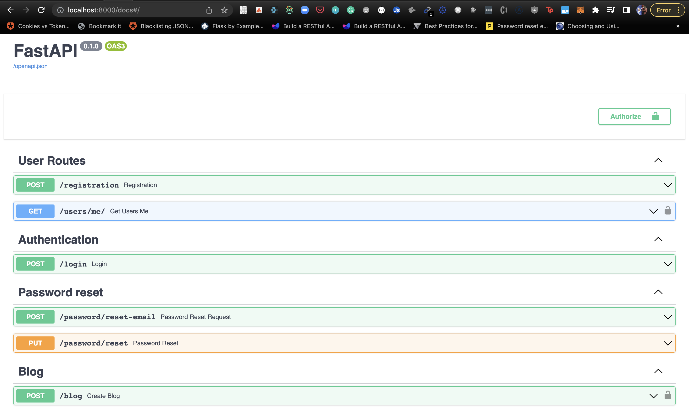

# Comprehensive API Development With FastAPI: How to Develop APIs with FastAPI and MongoDB

## Resources: 
1. [Youtube](https://www.youtube.com/watch?v=PNv_uLpM4QY&list=WL&index=38&t=13565s)
2. [FastAPI](https://fastapi.tiangolo.com/)
3. [MongoDB - Motor](https://motor.readthedocs.io/en/stable/)
4. [FastAPI-MAIL](https://sabuhish.github.io/fastapi-mail/)
5. [My curated Resources](https://brazen-gouda-57f.notion.site/FastAPI-and-MongoDB-5773093203f34cb192c42ec80066868b)
6. [Configure CI/CD Docker](https://docs.docker.com/language/python/configure-ci-cd/)

In this tutorial, learnt all about building and deploying APIs with [FastAPI](https://fastapi.tiangolo.com/) and performing CI/CD using github actions.

Built a full fledge api in python using [FastAPI](https://fastapi.tiangolo.com/). The api is for a blogging applications where, users can create, read, delete, update posts, as well as like other users posts and of course we will setup user registration and authentication.

## FastAPI Python Programming 
Learnt the fundamentals of API design with FastAPI including things like routes, serialization/deserialization, schema validation, models.

## MongoDB with FastAPI
Learnt about MongoDB and how to connect to a mongoDB database to perform different tasks such as storing data, retreiving data, updatind data and how to query a MongoDB database.

## Heroku Deployment 
Moved on to deployment stage where I deployed the API to heroku, and how to dockerize the application and deploy it to dockerhub. 

## CI/CD Github actions 
Finally built out a CI/CD pipeline using github actions so that I don't have to do everything manually all the time I want to deploy new features.

## Project Setup locally

Clone github repository
```
git clone https://github.com/PatrickCmd/blog-api-fastapi.git blog-api
```

Change directory to `blog-api`
```
cd blog-api
```

Set environment variables by making copy of `.env_example` to `.env` and setting the values correctly
```
cp ./api/.env_example ./api/.env
```

## Build and run project
Build and run docker containers
```
docker-compose up -d --build
```

Use your browser and go to `localhost:8000/docs`

